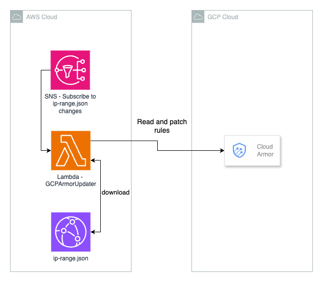

# Automated Cloud Armor Updater for AWS CloudFront IPs

This project provides an AWS Lambda function designed to automatically update Google Cloud Armor security policies with the latest CloudFront IP ranges. It ensures that your GCP infrastructure remains protected by dynamically adjusting to IP changes.

## Features

- **Automated Updates**: Fetches the latest CloudFront IP ranges and updates GCP Cloud Armor policies accordingly.
- **Rule Management**: Groups IPs into chunks (e.g., 10 per rule) to comply with GCP limitations.
- **Safe Rule Replacement**: Identifies and replaces only the rules previously added by this Lambda, preserving other custom rules.
- **Secure Credential Handling**: Utilizes AWS Secrets Manager to securely store and access GCP service account credentials.
- **Event-Driven Execution**: Triggered by AWS SNS notifications when CloudFront IP ranges change. [AWS Docs - AWS IP address ranges notifications](https://docs.aws.amazon.com/vpc/latest/userguide/subscribe-notifications.html)

## Architecture

_This section will include a diagram to illustrate the architecture of this solution._



## How It Works

This solution is designed to coexist with existing Cloud Armor rules. It exclusively manages rules related to AWS CloudFront IP ranges, leaving all other rules untouched.

The Lambda function identifies which rules it created by looking for a specific prefix in the `description` field (e.g., `(Managed by AWS Lambda) CloudFront IPs chunk`). This allows the system to safely remove only those entries and replace them with the most current version.


This solution does not rely on DynamoDB or S3 for state tracking. Instead, the Lambda function:

1. Fetches the current list of CloudFront IP ranges from AWS’s [ip-ranges.json](https://ip-ranges.amazonaws.com/ip-ranges.json).
2. Aggregates and groups the IPs into chunks of up to 10 CIDRs per Cloud Armor rule.
3. Retrieves the existing Cloud Armor policy using the GCP API.
4. Removes all rules previously created by the Lambda (identified by a specific description prefix).
5. Creates a fresh set of rules using the aggregated CloudFront CIDRs.
6. Submits all changes at once using the `patch` API call to Google Cloud Armor, ensuring immediate application.

This design allows fully stateless operation, triggered by event or manually, and always produces a complete up-to-date policy without intermediate storage.

## Prerequisites

### AWS

- **Secrets Manager**: Store your GCP service account JSON credentials in AWS Secrets Manager.
- **S3 Bucket**: An S3 bucket to store the packaged Lambda Layer ZIP file.
- **IAM Role**: An IAM role with permissions to execute Lambda functions and access Secrets Manager.

### GCP

- **Service Account**: Create a GCP service account with the following role:
  - **`roles/compute.securityAdmin`**: Allows managing Cloud Armor security policies.

- **Cloud Armor Security Policy**: Ensure the Google Cloud Armor security policy specified in your configuration already exists.

- **Enable APIs**:
  - The **Compute Engine API** must be enabled. You can enable it via the console or CLI:
    - Console: [Enable Compute Engine API](https://console.developers.google.com/apis/api/compute.googleapis.com/overview)
    - CLI:
      ```bash
      gcloud config set project YOUR_PROJECT_ID
      gcloud services enable compute.googleapis.com
      ```

## Deployment Steps

1. **Clone the Repository**:
   ```bash
   git clone https://github.com/yourusername/gcp-cloudarmor-updater.git
   cd gcp-cloudarmor-updater
   ```

2. **Package the Lambda Layer**:
   Use the provided shell script to package the necessary Python dependencies into a Lambda Layer.
   ```bash
   sh ./scripts/package_layer.sh
   ```

3. **Upload the Layer to S3**:
   ```bash
   aws s3 cp layer.zip s3://your-s3-bucket-name/path/to/layer.zip
   ```

4. **Deploy the CloudFormation Stack**:
   ```bash
   aws cloudformation deploy \
     --template-file cloudformation.yaml \
     --stack-name gcp-cloudarmor-updater \
     --capabilities CAPABILITY_NAMED_IAM \
     --parameter-overrides \
       GCPServiceAccountSecretName=YourSecretName \
       GCPArmorPolicyName=YourPolicyName \
       GCPArmorRulePriority=1000 \
       LayerS3Bucket=your-s3-bucket-name \
       LayerS3Key=path/to/layer.zip
   ```

5. **Populate Secrets Manager**:

   Store your GCP service account JSON credentials in AWS Secrets Manager under the name specified in `GCPServiceAccountSecretName` using AWS CLI:

   ```bash
   aws secretsmanager create-secret \
     --name YourSecretName \
     --secret-string file://path/to/your-gcp-credentials.json
   ```

   Replace `YourSecretName` with the name specified in your deployment parameters and `path/to/your-gcp-credentials.json` with the path to your downloaded GCP JSON credentials.

6. **Test the Lambda Function and initial setup the rules in Cloud Armor**:
   ```bash
   aws lambda invoke \
     --function-name GCPArmorUpdater \
     --payload '{}' \
     response.json
   ```

## Packaging the Lambda Layer

The `scripts/package_layer.sh` script automates the creation of a Lambda Layer containing the necessary Python dependencies.

Ensure you have `pip` installed and accessible in your environment before running this script.

## Contributing

We welcome community contributions! Please see [CONTRIBUTING.md](CONTRIBUTING.md) for guidelines.

## Security

See [CONTRIBUTING](CONTRIBUTING.md#security-issue-notifications) for more information.

## License

This library is licensed under the MIT-0 License. See the [LICENSE](LICENSE) file.

